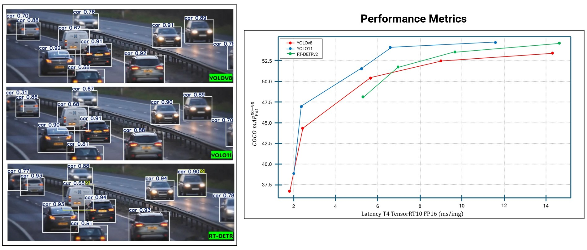

# 📘 YOLO Models and Real Time Detection Transformer

This document presents a comprehensive comparison of the latest object detection models: **YOLOv8**, **YOLOv10**, **YOLOv11**, **YOLOv12**, and **RT-DETRv2**. These models represent distinct architectural choices, performance goals, and deployment capabilities, making them valuable for different use cases ranging from edge devices to high-accuracy cloud-based applications.

---

## 1. Model Overview

The YOLO series has evolved significantly since its original release. YOLOv8, developed by Ultralytics, focuses on high-speed CNN-based detection. YOLOv10, YOLOv11, and YOLOv12 are developed as part of the YOLO-World initiative and aim to integrate transformer-based architectures with more intelligent learning strategies such as open-vocabulary detection and box-free training. Meanwhile, RT-DETRv2 is a modern, transformer-based model designed to address the real-time limitations of earlier DETR models.

---

## 2. Architecture Comparison

**YOLOv8** is built on traditional CNN modules such as `C2f`, `SPPF`, and `PAN`, with a strong emphasis on efficiency. It features an anchor-free, decoupled detection head and supports rotated bounding boxes (OBB).

**YOLOv10** begins the hybrid transition, combining CNN backbones with vision transformers. It enables open-vocabulary detection by aligning detection heads with text embeddings (e.g., CLIP), allowing it to generalize to unseen classes.

**YOLO11** pushes the transformer integration further, often using InternImage-H or similar backbones that apply deformable attention modules. It supports box-free training, allowing models to learn without requiring tight bounding box labels.

**YOLO12** is essentially DETR-inspired, using end-to-end transformer-based architecture. It replaces the typical NMS-based postprocessing with a one-to-one Hungarian matching loss. This reduces duplicate detections and allows for more direct optimization.

**RT-DETRv2** is a real-time evolution of the DETR family. It uses a decoupled detection head and efficient attention modules to achieve performance levels comparable to CNN-based detectors while preserving the simplicity and elegance of transformer-based set prediction.

---

## 3. Training and Fine-Tuning Strategies

Training strategies differ significantly across these models. YOLOv8 and YOLOv10 generally rely on supervised learning using COCO or ImageNet-style annotations. YOLOv10 and YOLOv11 also support open-vocabulary learning by embedding textual class descriptions, which allows the models to detect novel classes during inference.

YOLOv11 and YOLOv12 introduce box-free or label-free fine-tuning modes, reducing reliance on high-quality annotations. YOLOv12 and RT-DETRv2 embrace a set-based prediction paradigm that removes the need for NMS and uses matching algorithms during training.

---

## 4. Performance Snapshot

The table below summarizes key inference metrics for each model (approximate values on Tesla A100 GPU):

| Model     | COCO mAP | Speed (FPS) | Params (M) | Latency (ms) |
|-----------|----------|-------------|------------|---------------|
| YOLOv8x   | ~53.0    | ~165        | ~68        | ~6            |
| YOLOv10   | ~54.0    | ~140        | ~85        | ~7–8          |
| YOLOv11   | ~55.5    | ~120        | ~120       | ~10           |
| YOLOv12   | ~57.0    | ~100        | ~140+      | ~12–15        |
| RT-DETRv2 | ~56.0    | ~110–140    | ~100       | ~10–12        |

YOLOv8 is the fastest and lightest, suitable for embedded and mobile deployment. YOLOv10 and YOLOv11 offer a sweet spot between generalization and speed. YOLOv12 maximizes accuracy but at the cost of latency. RT-DETRv2 matches YOLOv11 and YOLOv12 in accuracy while retaining practical inference speed.

---

## 5. Deployment and Use Cases

Deployment suitability varies with the architecture. YOLOv8 and YOLOv10 are highly optimized for edge deployment and are easily converted to formats like ONNX and TensorRT. YOLOv11 and YOLOv12, with heavier backbones, are more suited for cloud or server environments where latency is less critical. RT-DETRv2 aims to bridge this gap by optimizing the transformer design to run efficiently even in real-time applications.

In terms of use cases:
- **YOLOv8** is ideal for fast, resource-constrained applications like robotics, drones, and mobile vision.
- **YOLOv10** and **YOLO11** are great for general-purpose and open-vocabulary tasks, such as retail product recognition or wildlife monitoring.
- **YOLO12** is best for scenarios where detection quality is critical and high latency is acceptable (e.g., medical imaging).
- **RT-DETRv2** is well-suited for real-time applications requiring accurate predictions without post-processing, such as autonomous driving or live video analysis.

---
## 6. YOLO and RT-DETR artifacts

  

---
## 7. Summary

Each model brings something unique:

- **YOLOv8**: Best for speed and simplicity. Fully CNN. Anchor-free.
- **YOLOv10**: Hybrid model that brings open-vocabulary to YOLO.
- **YOLO11**: Strong backbone with transformer power and label-free fine-tuning.
- **YOLO12**: DETR-style end-to-end transformer model with high accuracy.
- **RT-DETRv2**: Efficient DETR variant for real-time, high-accuracy use.

---
## 🔗 References

- [YOLOv8](https://docs.ultralytics.com/models/yolov8/)
- [YOLO11](https://docs.ultralytics.com/models/yolo11/)
- [RT-DETRv2](https://docs.ultralytics.com/models/rtdetr/)